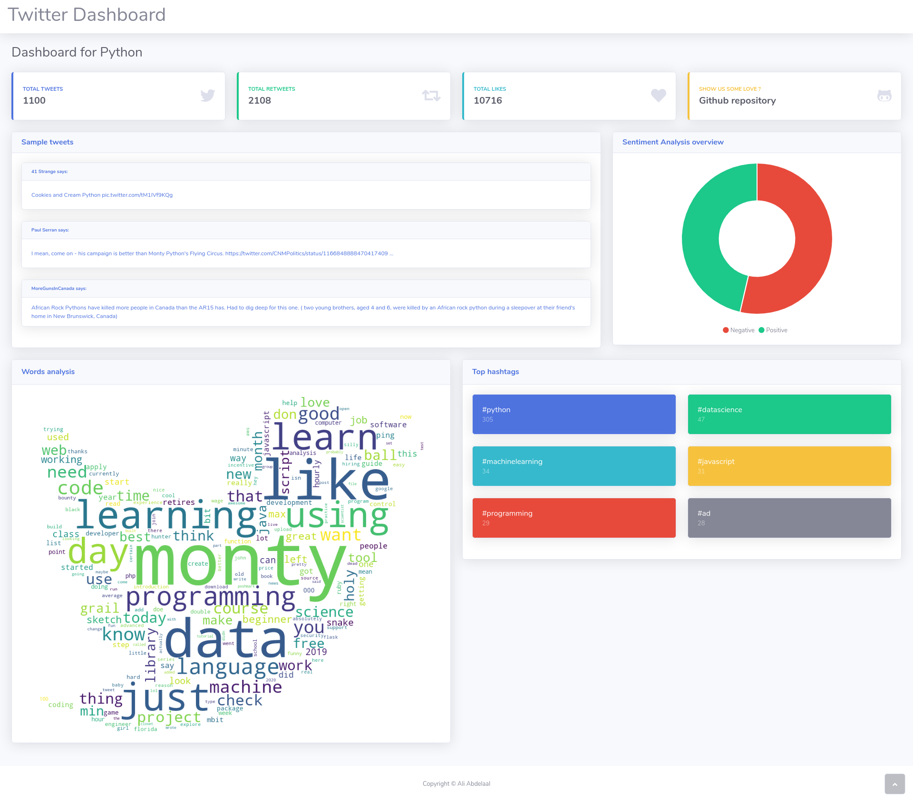
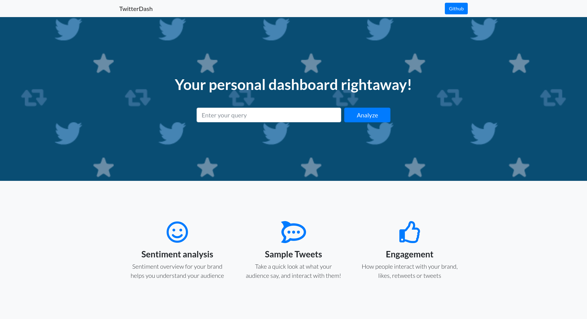

# A Simple Twitter dashboard

A dashboard for any custom query with simple analysis tools



the dashboard runs in the local host, it's still a little bit slow, but that's an early version, most probably i will be working on it's performance.

## Installation

to use the dashboard follow these steps

* install all the requirements

```bash
$pip install -r requirements.txt
```

Now you are ready to go !

* start the app from `app.py`

```bash
$python app.py
```

you will find a message ending with the url like so

```bash
 * Running on http://127.0.0.1:5000/ (Press CTRL+C to quit)
```

Jump into the link and you will directed to the landing page

## Usage tips

* The max number of tweets are set to 1000 and for only one month back, you can override these option in the `twitterdash/scraper.py` file.
* Changing the `poolsize` in `twitterdash/scraper.py` will affect the speed of scraping but also the performance of your machine, don't get too far with it.



you can type your query and press analyse to get the dashboard, it's a little bit slow, but it works :D

## References

* Pages design were made possible by [Bootstrap studio](https://bootstrapstudio.io)
* For Twitter scraping i used [twitterscraper](https://github.com/taspinar/twitterscraper) package, which is pretty useful !
* Word cloud is pretty easy using [word_cloud](https://github.com/amueller/word_cloud) package.
* Sentiment analysis here were made using [TextBlob](https://github.com/sloria/textblob) library.
